# Device Failure Analysis - notebook
Dave Hurst  


# EDA


```r
data <- fread('device_failure.csv')
data[ , date := ymd(date)]
bind_rows(head(data), tail(data))
```

```
##           date   device failure attribute1 attribute2 attribute3
##  1: 2015-01-01 S1F01085       0  215630672         56          0
##  2: 2015-01-01 S1F0166B       0   61370680          0          3
##  3: 2015-01-01 S1F01E6Y       0  173295968          0          0
##  4: 2015-01-01 S1F01JE0       0   79694024          0          0
##  5: 2015-01-01 S1F01R2B       0  135970480          0          0
##  6: 2015-01-01 S1F01TD5       0   68837488          0          0
##  7: 2015-11-02 Z1F0KKN4       0  218765712          0          0
##  8: 2015-11-02 Z1F0MA1S       0   18310224          0          0
##  9: 2015-11-02 Z1F0Q8RT       0  172556680         96        107
## 10: 2015-11-02 Z1F0QK05       0   19029120       4832          0
## 11: 2015-11-02 Z1F0QL3N       0  226953408          0          0
## 12: 2015-11-02 Z1F0QLC1       0   17572840          0          0
##     attribute4 attribute5 attribute6 attribute7 attribute8 attribute9
##  1:         52          6     407438          0          0          7
##  2:          0          6     403174          0          0          0
##  3:          0         12     237394          0          0          0
##  4:          0          6     410186          0          0          0
##  5:          0         15     313173          0          0          3
##  6:         41          6     413535          0          0          1
##  7:          0          9     353525          0          0          0
##  8:          0         10     353705          8          8          0
##  9:          4         11     332792          0          0         13
## 10:          0         11     350410          0          0          0
## 11:          0         12     358980          0          0          0
## 12:          0         10     351431          0          0          0
```

We've got a dataset with 124494 rows.  It looks to be daily logs for devices with a failure indicator (the target) and unidentified attributes associated with each log entry.

There are only 9 attributes here, so we can look at them cases by case, but first let's look at the metadata for each record: 

## Date

The date range of the data goes from January to November of 2015 with at a daily/device grain


```r
range(data$date)
```

```
## [1] "2015-01-01" "2015-11-02"
```

```r
length(unique(data$date))
```

```
## [1] 304
```

Let's look at how many records we get in the log each day 


```r
data %>% count(date) %>%
    ggplot(aes(date, n)) + geom_line() + 
    ggtitle('number of daily log entries')
```

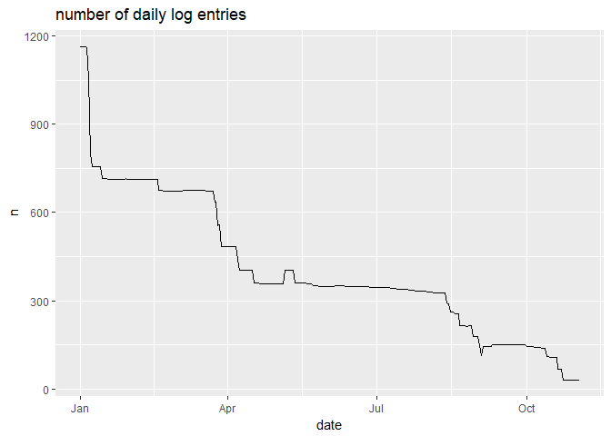<!-- -->

The amount of data looks to be diminishing over time.  Since each row represents a device, it looks like we're starting with a pool of devices that get pulled out the population as they fail.

To verify that, we should be able to look at the devices we have have left at the end and make sure we've been getting data for them all along:


```r
n_devices <- length(unique( data$device))
survived <- data[date == max(date), unique(device)]
day1_chk <- data[date == min(date), device %in% survived]
sum(day1_chk) == length(survived)
```

```
## [1] TRUE
```

So that *appears* to be true, except the population of drives *increases* for a few days in late April and August.  I'll just note that for now, but it could be indicative of data errors or some other anomoly.  It's also worth noting there doesn't appear to be any distinct periodic patterns (e.g. weekends), although a couple of days have unusual drops, which might indicate some date related event.

*Update from the future:* Now I know that a decrease in devices is not due solely to failure the increases aren't as worrisome.

## Device

There are 1168 unique devices in the data. Right now it looks like the number of log entries for each device is a good indication of the survival duration, so lets look at that distribution


```r
data %>% group_by(device) %>% summarize(n_days = n()) %>%
    ggplot(aes(n_days)) + geom_histogram(bins=30)
```

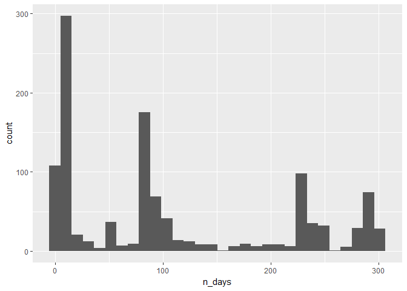<!-- -->

It looks like survival rates are clustered.

## Failure

Failure is the target variable.  Most the devices are removed from the log at some point, but the ratio of failures in the log file will be small because devices report success until they fail.


```r
n_fails <- data[, sum(failure)]
pct_removed <- percent( 1 - length(survived) / n_devices)
pct_fails_log <- percent( n_fails / nrow(data))
pct_fail_rm <- percent( n_fails / (n_devices - length(survived)) )
c(pct_removed, pct_fails_log, pct_fail_rm)
```

```
## [1] 97.35% 0.09%  9.32%
```

That's a surprise. Only 9% of the drives removed from service (or the data) actually failed. It appears that devices are pulled from service (or data is removed from the log) that don't necessarily fail.  We might still be able to predict failures, but a survival analysis wouldn't be possible with this data. 

Let's check whether devices are put back in the field after failure (perhaps repaired):


```r
# devices that have a non-failing last log entry (excluding those that survive the entire time)
fail_agg <- data %>% group_by(device) %>% arrange(date) %>%
    summarize(n_fails = sum(failure),
              last_date = max(date),
              last_fail = failure[n()] == 1) %>%
    filter(n_fails > 0)

# double check that devices can only fail once
max(fail_agg$n_fails) == 1
```

```
## [1] TRUE
```

```r
# percent of failures that happened on the last log entry
percent(sum(fail_agg$last_fail) / nrow(fail_agg))
```

```
## [1] 95.28%
```

That's another surprise.  Of 106, a handful don't fail on the last log entry, so maybe they are repaired, or failure means something other than complete failure.  Let's look at when those fail on the time line:


```r
zombies <- fail_agg %>% filter(! last_fail) %>% select(device) %>% .[[1]]
data %>% filter(device %in% zombies) %>%
    mutate(device = as.factor(device)) %>%
    ggplot(aes(x=date, y=device, height=failure * .5, group=device)) + #geom_line()  
    geom_ridgeline(alpha = .6, fill='skyblue')
```

<!-- -->

3 of the 5 have very short lives after the failure date, which might be a residual of the way the aggregation is done. It might make sense to remove those log entries from the training dataset, especially given that no devices fail twice.

Let's also look at a cum plot of all the failures over time


```r
data %>% group_by(date) %>%
    summarize(n_fails = sum(failure),
              n_recs = n()) %>%
    mutate( cum_fails = cumsum(n_fails)) %>%
    ggplot(aes(date, cum_fails)) + geom_line() 
```

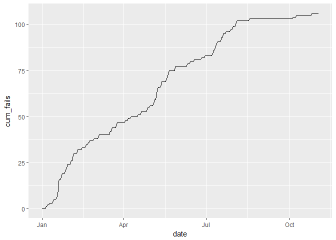<!-- -->

That's a pretty steady rate of failure through August and then it levels off significantly.  That would make date a potential good prediction, at least for a tree based model, but its kind of cheating.  Maybe device failures in last x days as a feature?

Let's also improve on initial original plot by adding rug plot of the failures. There doesn't seem to be a lot of correlation between days with more failures and devices being removed from the log.


```r
fails <- data %>% filter(failure == 1)
data %>% group_by(date) %>%
    summarize(n_fails = sum(failure),
              n_recs = n()) %>%
    mutate( cum_fails = cumsum(n_fails)) %>%
    ggplot(aes(date, n_recs)) + geom_line() + 
    geom_rug(data = fails, aes(date, y=1), sides = 'tb', position = "jitter")
```

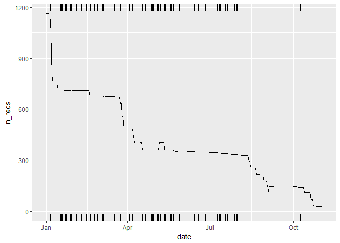<!-- -->

There's some important information here. The big drop off in devices that happens in day 5 and 6 are not attributable to a corresponding surge in failures.  Over 400 function devices are taken from the log in the first 5-6 days.  We'll need to think about how we treat those in our modeling.

Attributes 1-9 are all integer, but are they?  Some look like error codes, so they should be factors (categorical).  Some look like they would benefit from log transformation (depending on the model we use).  Let's put together a summary view of all 9.

## Attributes 1-9


```r
asummary <- tibble(name = paste0('attribute', 1:9))
attr_only <- data %>% select(starts_with('attr'))
asummary$n_unique <- map_int( attr_only, function(.x) length(unique(.x)))
asummary$pct_zero <- percent(map_dbl( attr_only, function(.x) mean(.x == 0)))
asummary$range <- map_chr( attr_only, function(.x) paste(range(.x), collapse = ', '))
asummary$range2 <- map_chr( attr_only, function(.x) paste(range(.x[.x != 0]), collapse = ', '))
asummary$mean <- map_dbl( attr_only, mean)
asummary$median <- map_dbl( attr_only, median)
asummary$sd <- map_dbl( attr_only, sd)
rm(attr_only)
kable(asummary)
```


name          n_unique   pct_zero  range          range2                     mean        median             sd
-----------  ---------  ---------  -------------  ----------------  -------------  ------------  -------------
attribute1      123878      0.01%  0, 244140480   2048, 244140480    1.223868e+08   122795744.0   7.045960e+07
attribute2         558     94.87%  0, 64968       8, 64968           1.594848e+02           0.0   2.179658e+03
attribute3          47     92.66%  0, 24929       1, 24929           9.940455e+00           0.0   1.857473e+02
attribute4         115     92.50%  0, 1666        1, 1666            1.741120e+00           0.0   2.290851e+01
attribute5          60      0.00%  1, 98          1, 98              1.422269e+01          10.0   1.594302e+01
attribute6       44838      0.00%  8, 689161      8, 689161          2.601729e+05      249799.5   9.915101e+04
attribute7          28     98.83%  0, 832         6, 832             2.925282e-01           0.0   7.436924e+00
attribute8          28     98.83%  0, 832         6, 832             2.925282e-01           0.0   7.436924e+00
attribute9          65     78.20%  0, 18701       1, 18701           1.245152e+01           0.0   1.914256e+02


```r
plot_density <- function(data, trans = NULL) {
    data <- data %>% mutate(failure = as.factor(failure))
    lin_plt <-  data %>% ggplot(aes(var, color = failure)) + geom_density(size=.8)
    if (is.null(trans)) {
        return(lin_plt)
    } else {
        trans_plt <- data %>% ggplot(aes(trans(var), color = failure)) + geom_density(size=.8)
        return(plot_grid(lin_plt, trans_plt, labels=c('linear', 'trans')))
    } 
}
```


### attribute1


Most the a1 values are unique and they are quite high.  We'll assume for now these are continuous.  This could be something like device operation counts


```r
plot_density( data %>% mutate(var = attribute1))
```

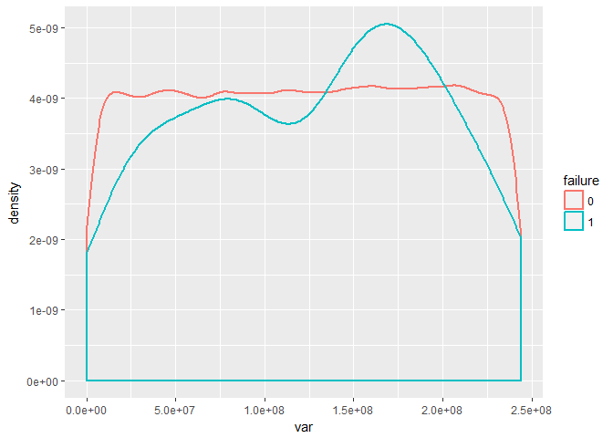<!-- -->

### attribute2


```r
plot_density( data %>% mutate(var = attribute2), trans = log1p)
```

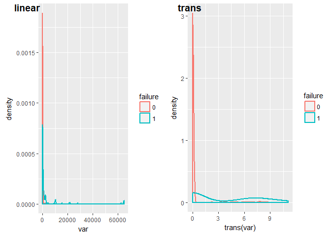<!-- -->


This kind of looks like error codes. At a minimum I'll want to create an is_zero feature for this.

### attribute3

Similar to attribute 2 


```r
plot_density( data %>% mutate(var = attribute3), trans = log )
```

```
## Warning: Removed 115359 rows containing non-finite values (stat_density).
```

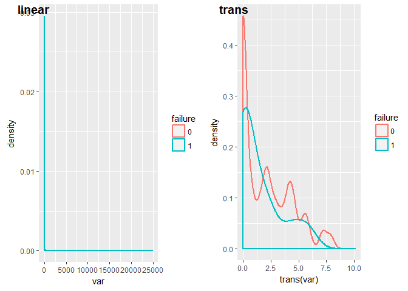<!-- -->


### attribute 4


```r
plot_density( data %>% mutate(var = attribute4), trans = log )
```

```
## Warning: Removed 115156 rows containing non-finite values (stat_density).
```

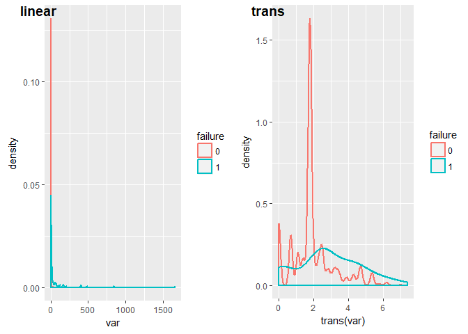<!-- -->

That spike is notable

### attribute 5

This one's different


```r
plot_density( data %>% mutate(var = attribute5), trans = log )
```

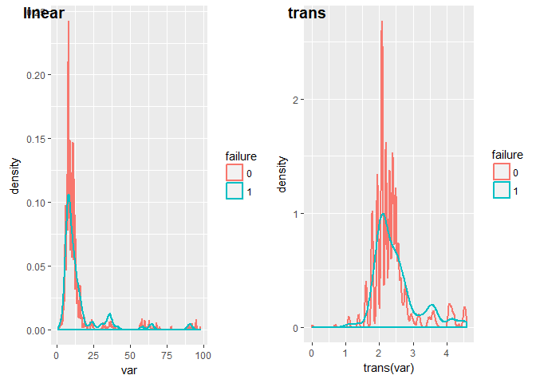<!-- -->

### attribute6

Similar to attribute 2 


```r
plot_density( data %>% mutate(var = attribute6), trans = log )
```

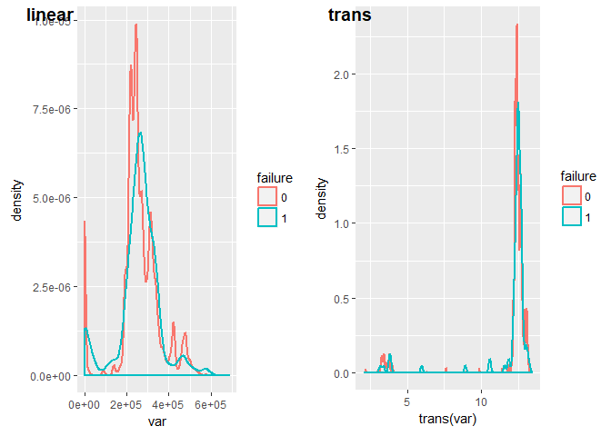<!-- -->


### attribute7

Similar to attribute 2 


```r
plot_density( data %>% mutate(var = attribute7), trans = log )
```

```
## Warning: Removed 123036 rows containing non-finite values (stat_density).
```

<!-- -->

### attribute8


```r
plot_density( data %>% mutate(var = attribute8), trans = log )
```

```
## Warning: Removed 123036 rows containing non-finite values (stat_density).
```

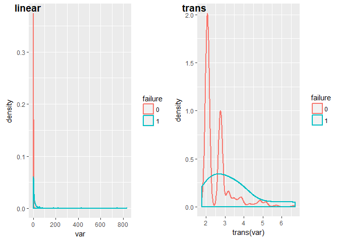<!-- -->

That looks really familiar.  Is it the same as a7?  


```r
with(data, cor(attribute7, attribute8))
```

```
## [1] 1
```

```r
with(data, identical(attribute7, attribute8))
```

```
## [1] TRUE
```

```r
data$attribute8 <- NULL
```

looks like we can drop a8 atttibute 

### attribute9

Similar to attribute 2 


```r
plot_density( data %>% mutate(var = attribute9), trans = log1p )
```

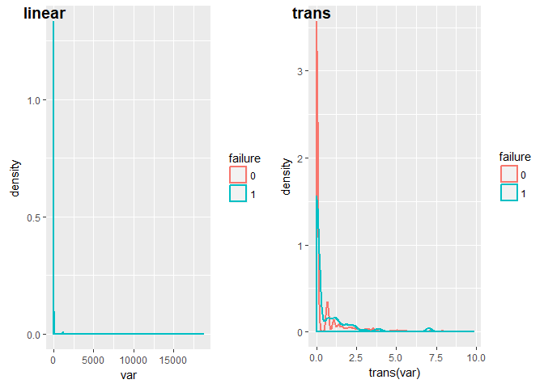<!-- -->

# Preliminary Model

The simplest thing to start with is logistic regression with the data as it is. I doubt that's going to be very effective though, since this will be massively imbalanced. It would also be hard to pick up degradation effects, so its likely I'll want to do a lot of reshaping.  Markov chains are popping out as a likely modeling candidate.
Still I want to see what I get without a lot of work, so I'll start with a random forest model.


5 fold cross validate


```r
set.seed(9)

kfold <- 5
dfold_lkp <- data.table(device = data[ , unique(device)])
dfold_lkp[, fold := 1:.N %% kfold + 1 ]
attr_names <- sort(names(data)[grepl('attr', names(data))])
formula <- as.formula(sprintf('failure ~ %s', paste(attr_names, collapse = ' + ')))

setkey(dfold_lkp, device)
setkey(data, device)
trn <- data[dfold_lkp, nomatch=0][ ,failure := as.factor(failure)]
trn$pred_fail <- factor(NA, levels = levels(trn$failure))
trn$pred_prob <- -1.

for (i in 1:kfold) {
    bal_fail <- trn[fold != i & failure == 1]
    bal_pass <- trn[fold != i & failure == 0][sample(1:.N, nrow(bal_fail))] 
    bal_trn <- rbind(bal_fail, bal_pass) %>% sample_frac()

    rf1 <- randomForest(formula, bal_trn)
    rf1.trn_roc <- roc(rf1$votes[,2], bal_trn$failure)
    #plot(rf1.trn_roc, main=sprintf('ROC fold=%d', i))

    rf1.val <- predict(rf1, newdata = trn[fold == i], type = 'vote', norm.votes = TRUE)
    trn[fold == i, pred_prob := rf1.val[,2]] 
    trn[fold == i, pred_fail := predict(rf1, newdata = trn[fold == i])] 
    rf1.val_roc <- roc(rf1.val[,2], trn[fold == i, failure])
    #plot(rf1.val_roc, add=TRUE, col='blue')

    cat(sprintf('fold=%d  AUC: trn= %4.2f val= %4.2f\n', i, auc(rf1.trn_roc), auc(rf1.val_roc)))
    rm(bal_trn, bal_fail, bal_pass)
}
```

```
## fold=1  AUC: trn= 0.87 val= 0.87
## fold=2  AUC: trn= 0.81 val= 0.91
## fold=3  AUC: trn= 0.89 val= 0.84
## fold=4  AUC: trn= 0.89 val= 0.84
## fold=5  AUC: trn= 0.88 val= 0.86
```


```r
rf1.roc <- roc(trn$pred_prob, trn$failure)
plot(rf1.val_roc, col='blue', main = sprintf('ROC for %d fold CV  AUC = %4.2f', kfold, auc(rf1.roc)) )
```

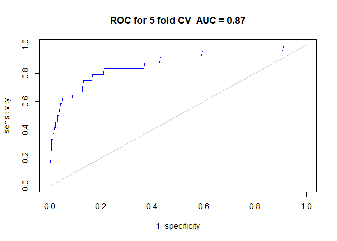<!-- -->

The AUC is much better than I'd expected but the general metrics aren't very good due to a large number of false positives


```r
rf1_metrics <- data.frame()
for (cut in seq_len(10) * .1) {
    pred_cut <- factor(ifelse( trn$pred_prob >= cut, 1, 0))

    cm <- table(pred_cut, trn$failure)
    if (nrow(cm) == 2) {
        cm_precision <- cm[2,2] / sum(cm[2,]) 
        cm_recall <- cm[2,2] / sum(cm[ ,2])
        cm_accuracy <- (cm[1,1] + cm[2,2]) / sum(cm)
        cm_f1 <- 2 * cm_precision * cm_recall / (cm_precision + cm_recall)
        rf1_metrics <- rbind(rf1_metrics, data.frame(cutoff = cut, 
                                                     precision = percent(cm_precision), 
                                                     recall = percent(cm_recall), 
                                                     accuracy = percent(cm_accuracy), 
                                                     F1 = percent(cm_f1)))
    }
}
rf1_metrics
```

```
##   cutoff precision recall accuracy    F1
## 1    0.1     0.11% 96.23%   28.22% 0.23%
## 2    0.2     0.17% 88.68%   54.58% 0.33%
## 3    0.3     0.25% 80.19%   72.32% 0.49%
## 4    0.4     0.39% 78.30%   82.73% 0.77%
## 5    0.5     0.52% 73.58%   87.97% 1.03%
## 6    0.6     0.68% 70.75%   91.21% 1.35%
## 7    0.7     1.05% 67.92%   94.54% 2.07%
## 8    0.8     1.75% 49.06%   97.62% 3.39%
## 9    0.9     3.73% 25.47%   99.38% 6.51%
```

```r
rf1_metrics %>% gather(metric, value, -cutoff) %>%
    ggplot(aes(cutoff, value, col = metric)) + geom_line()
```

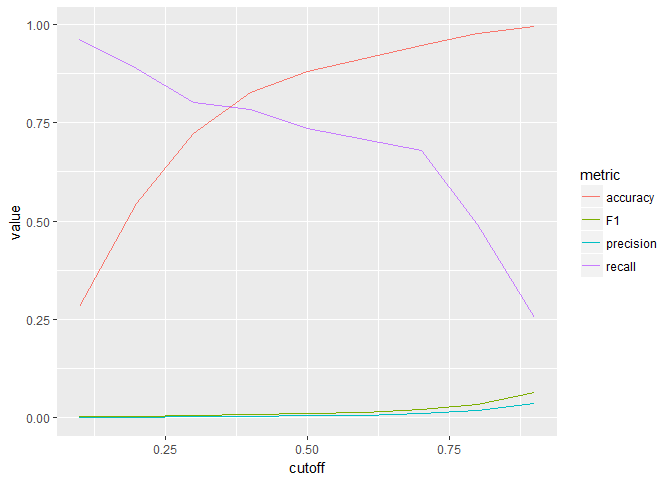<!-- -->

# EDA Device Time Series 

I think it will be better to look at this dataset at the device level.  Since ~ 10% of the devices fail its still imbalanced, but not as egregiously as it is at a device-day grain. My hope is that sudden changes in the attribute measures will be indicative of failure, so a model will look at metrics just prior to the last day and see if that gives us insight into which were removed due to failure.

To start off we'll need to figure out how we want to look at the time series.  Let's start of by looking attribute1 for an arbitrary device.


```r
dev_rec <- data %>% group_by(device) %>% 
    summarize( n = n(),
               failure = as.factor(max(failure)),
               rdate = max(date)) %>%
    arrange(n)
d1 <- rev(dev_rec$device)[500]  # pull one out of the middle so its not too short lived
data %>% filter(device == d1) %>% 
    ggplot(aes(date, attribute1)) + geom_line() + geom_point()
```

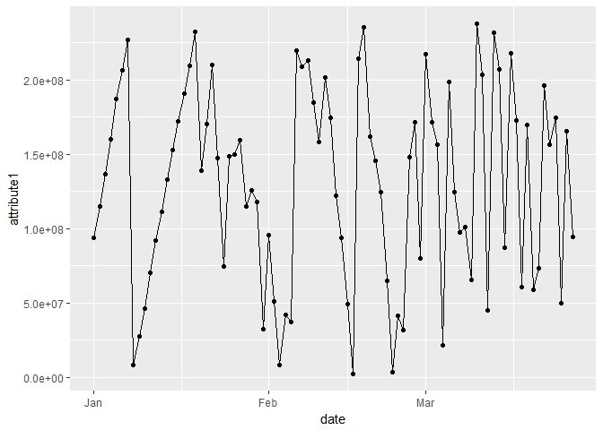<!-- -->

The two long sloping lines are suspicious ... imputed data? It looks (from the sloping lines) like devices don't necessarily report every day.  Let's look at a cohort of devices that were retired on the same day and see if they have the same number of records


```r
d1_info <- data %>% filter(device == d1) %>% summarize(nrec = n(), rdate = max(date))
d1_diff <- data %>% group_by(device) %>% filter(max(date) == d1_info$rdate) %>% 
    summarise(n_rec_diff = n() - d1_info$nrec,
              failure = as.factor(max(failure)))
d1_diff %>%
    ggplot(aes(device, n_rec_diff)) + geom_point(aes(col = failure)) + coord_flip()
```

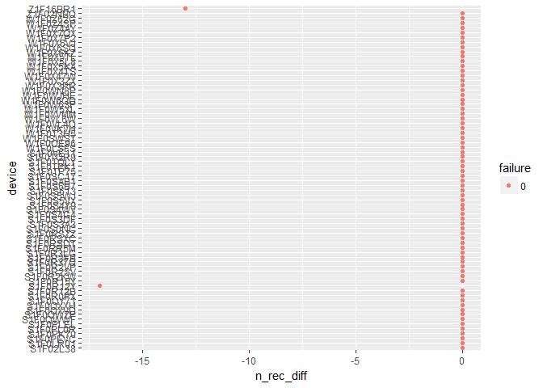<!-- -->

```r
d1_diff %>% filter(n_rec_diff != 0)
```

```
## # A tibble: 2 x 3
##     device n_rec_diff failure
##      <chr>      <int>  <fctr>
## 1 S1F0R12Y        -17       0
## 2 Z1F16BR1        -13       0
```

Most have the same, but some don't.  Plots for these (not shown) have the same slopes without the 
intermediate data points, so they were apparenetly not imputed.  Since none of these devices failed,
I'm going to ignore this line of investigation.  Moving on...

Here's a look at all the attributes for the same device.


```r
data %>% filter(device == d1) %>% 
    gather(attr, value, starts_with('attr')) %>%
    ggplot(aes(date, value)) + geom_line()  +
    facet_wrap(~ attr, scales = 'free_y')
```

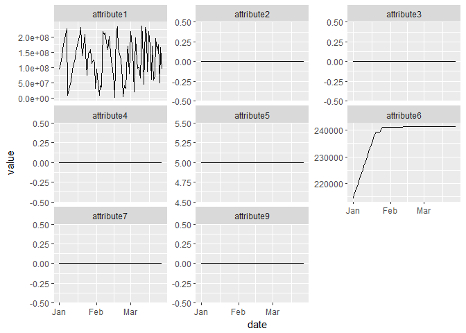<!-- -->

Let's add a few more to the picture and see how they overlap:


```r
d4 <- rev(dev_rec$device)[seq(550, 700, 50)]  # 
data %>% filter(device %in% d4) %>% summarise(nfail = sum(failure)) 
```

```
##   nfail
## 1     0
```

```r
data %>% filter(device %in% d4) %>% 
    gather(attr, value, starts_with('attr')) %>%
    ggplot(aes(date, value, col=device)) + geom_line()  +
    facet_wrap(~ attr, scales = 'free_y')
```

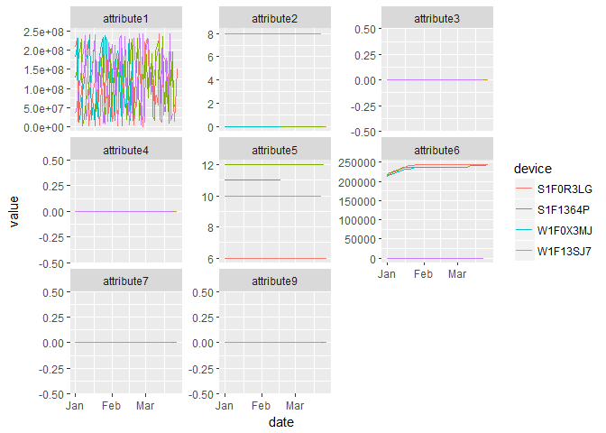<!-- -->

Let's add a couple failures from around the same point in time


```r
d4_rdate <- dev_rec[dev_rec$device == d4[1], ]$rdate
# use names startig with Z just so they are easier to pick out in the plot
dfail <- dev_rec %>% filter(failure == 1, rdate > d4_rdate, grepl('^Z', device)) %>% first() #%>% first()
dfail <- dfail[1:2]  # cause dplyr::first is broken
data %>% filter(device %in% c(d4, dfail)) %>%  
    gather(attr, value, starts_with('attr')) %>%
    ggplot(aes(date, value, col=device)) + geom_line()  +
    facet_wrap(~ attr, scales = 'free_y')
```

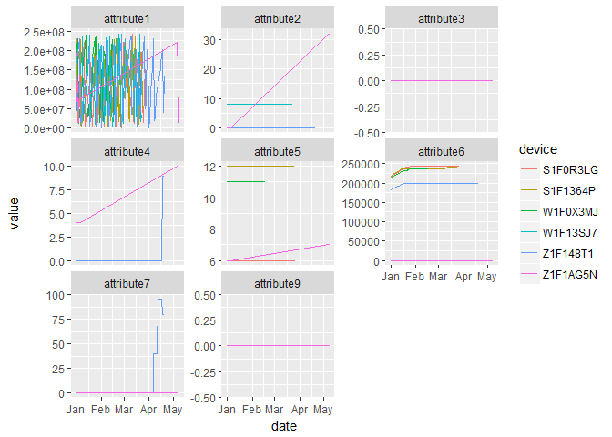<!-- -->

Looks like there is a lot of differentiation between the failures, although they span different attributes.  Looking for baseline changes should be a good indicator.  

One thing jumps out is the huge gap in records for Z1F1AG5N.  Let's check the stats on gaps and whether there's any correlation to failure:


```r
dev_gap <- data %>% group_by(device) %>% arrange(date) %>%
    summarise( max_gap = as.integer(max(diff(date))),
               failure = max(failure))
with(dev_gap, cor(failure, max_gap))
```

```
## [1] 0.02155045
```

Nope.

# Data Transformation / Feature Engineering


```r
glast <- function(x, n) { 
    n <- min(length(x), n)
    rev(x)[1:n] %>% rev() 
}
glast_z <- function(x, n, xm = mean(x), xsd = sd(x)) {
    (glast(x, n) - xm) / xsd
}
max_abs_val <- function(x) x[which.max(abs(x))]

a1g_mean <- asummary[1,]$mean
a1g_sd <- asummary[1,]$sd
build_fea <- function(df) {
    n5d_fail <- df %>% group_by(date) %>% 
        summarize( nf = sum(failure == 1)) %>%
        mutate( n5d_fails = 
                    lag(nf, 1,def=0) + 
                    lag(nf, 2,def=0) + 
                    lag(nf, 3,def=0) + 
                    lag(nf, 4,def=0) +
                    lag(nf, 5,def=0) ) %>%
        select(rdate = date, n5d_fails)

    dev_fea <- df %>% group_by(device) %>% arrange(date) %>%
        summarise( failure = max(failure),
                   n_rec = n(),
                   max_gap = as.integer(max(diff(date))),
                   rdate = max(date),
                   a1_mean = mean(attribute1),
                   a1_sd = sd(attribute1),
                   a1_maxl4_z = max_abs_val( glast_z( attribute1, 4)),
                   a1_maxl4_zglob = max_abs_val( glast_z( attribute1, 4, 
                                                          xm = a1g_mean, 
                                                          xsd = a1g_sd) ),
                   a1_last = glast(attribute1, 1),
                   
                   a2_mean = mean(attribute2),
                   a2_sd = sd(attribute2),
                   a2_last = glast(attribute2, 1),
                   a2_drift = attribute2[1] - glast(attribute2, 1),
                   
                   a3_mean = mean(attribute3),
                   a3_sd = sd(attribute3),
                   a3_last = glast(attribute3, 1),
                   a3_drift = attribute3[1] - glast(attribute3, 1),
                   
                   a4_mean = mean(attribute4),
                   a4_sd = sd(attribute4),
                   a4_last = glast(attribute4, 1),
                   a4_drift = attribute4[1] - glast(attribute4, 1),

                   a5_mean = mean(attribute5),
                   a5_sd = sd(attribute5),
                   a5_last = glast(attribute5, 1),
                   a5_drift = attribute5[1] - glast(attribute5, 1),
                   
                   a6_mean = mean(attribute6),
                   a6_sd = sd(attribute6),
                   a6_last = glast(attribute6, 1),
                   a6_drift = attribute6[1] - glast(attribute6, 1),
                   
                   a7_mean = mean(attribute7),
                   a7_sd = sd(attribute7),
                   a7_last = glast(attribute7, 1),
                   a7_drift = attribute7[1] - glast(attribute7, 1),
                   
                   a9_mean = mean(attribute9),
                   a9_sd = sd(attribute9),
                   a9_last = glast(attribute9, 1),
                   a9_drift = attribute9[1] - glast(attribute9, 1) 
        )  %>%
        left_join(n5d_fail, by = 'rdate')
}
```

# Models

## randomForest 

Random Forest on the new dataset using 10 fold cross validation.  We'll evaluate the model using the CV predictions.


```r
set.seed(9)
trn <- build_fea(data) %>% sample_frac()

kfold <- 10
trn <- trn %>% mutate( 
    failure = as.factor(failure),
    fold = row_number() %% kfold + 1 )

get_formula <- function(x) {
    fea_names <- sort(names(x)[grepl('^a[0-9]', names(x))])
    as.formula(sprintf('failure ~ n_rec + max_gap + %s', paste(fea_names, collapse = ' + ')))
}

trn$pred_fail <- factor(NA, levels = levels(trn$failure))
trn$pred_prob <- -1.

trn <- data.table(trn)

rf2_cv <- list()
for (i in 1:kfold) {

    rf2 <- randomForest(get_formula(trn), trn[fold != i])
    rf2.trn_roc <- roc(rf2$votes[,2], trn[fold != i, failure])
    #plot(rf2.trn_roc, main=sprintf('ROC fold=%d', i))

    rf2.val <- predict(rf2, newdata = trn[fold == i], type = 'vote', norm.votes = TRUE)
    trn[fold == i, pred_prob := rf2.val[,2]] 
    trn[fold == i, pred_fail := predict(rf2, newdata = trn[fold == i])] 
    rf2.val_roc <- roc(rf2.val[,2], trn[fold == i, failure])
    #plot(rf2.val_roc, add=TRUE, col='blue')

    cat(sprintf('fold=%d  AUC: trn= %4.2f val= %4.2f\n', i, auc(rf2.trn_roc), auc(rf2.val_roc)))
    rf2_cv[[i]] <- rf2
}
```

```
## fold=1  AUC: trn= 0.94 val= 0.96
## fold=2  AUC: trn= 0.94 val= 0.99
## fold=3  AUC: trn= 0.94 val= 0.97
## fold=4  AUC: trn= 0.95 val= 0.88
## fold=5  AUC: trn= 0.94 val= 0.97
## fold=6  AUC: trn= 0.94 val= 0.96
## fold=7  AUC: trn= 0.94 val= 0.97
## fold=8  AUC: trn= 0.95 val= 0.91
## fold=9  AUC: trn= 0.94 val= 0.92
## fold=10  AUC: trn= 0.94 val= 0.96
```

Here's the ROC plot for the results


```r
rf2.roc <- roc(trn$pred_prob, trn$failure)
plot(rf2.val_roc, col='blue', main = sprintf('randomForest ROC for %d fold CV  AUC = %5.3f', kfold, auc(rf2.roc)) )
```

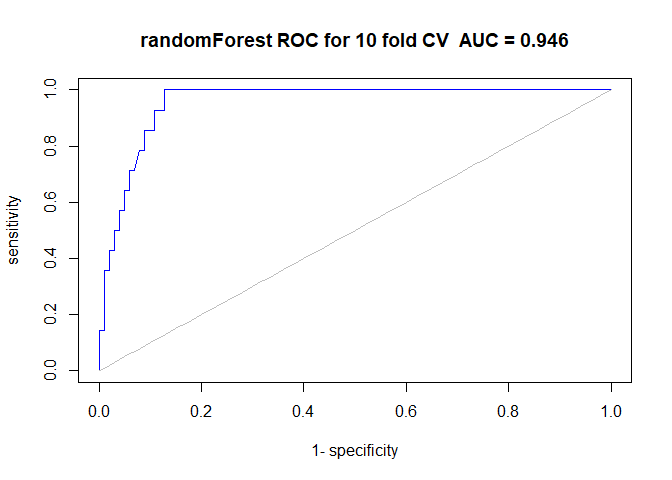<!-- -->

AUC is the primary evaluation metric since we don't have any way to weight the cost of false positives (unnecessary inspection) and false negatives (failure in the field).  Since those probably aren't equivalent, its also prudent to plot other evaluation metrics as a function of the cutoff.


```r
metrics <- data.frame()  #HACK: global for the markdown extraction
plot_metrics <- function(probs, truth, auc_score) {
    metrics <<- data.frame()
    for (cut in seq_len(20) * .05) {
        pred_cut <- factor(ifelse( probs >= cut, 1, 0))
        
        cm <- table(pred_cut, truth)
        if (nrow(cm) == 2) {
            cm_precision <- cm[2,2] / sum(cm[2,]) 
            cm_recall <- cm[2,2] / sum(cm[ ,2])
            cm_accuracy <- (cm[1,1] + cm[2,2]) / sum(cm)
            cm_f1 <- 2 * cm_precision * cm_recall / (cm_precision + cm_recall)
            metrics <<- rbind(metrics, 
                                 data.frame(cutoff = cut, 
                                            precision = percent(cm_precision), 
                                            recall = percent(cm_recall), 
                                            accuracy = percent(cm_accuracy), 
                                            F1 = percent(cm_f1),
                                            auc = percent(auc_score)))
        }
        
    }
    metrics %>% gather(metric, value, -cutoff) %>%
        ggplot(aes(cutoff, value, col = metric)) + 
        geom_line(size=1.3) +
        annotate('text', x=0.1, y=auc_score, label='AUC', vjust = -0.6)
}
plot_metrics(trn$pred_prob, trn$failure, auc(rf2.roc)) +
    ggtitle(sprintf('CV Metrics for RandomForest AUC = %5.3f', auc(rf2.roc)))
```

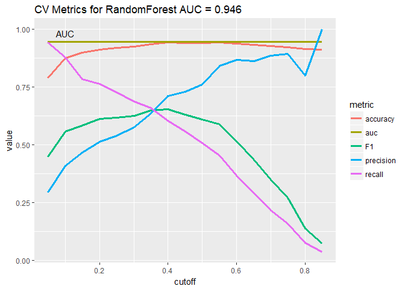<!-- -->


```r
table(trn$pred_fail, trn$failure)
```

```
##    
##        0    1
##   0 1045   52
##   1   17   54
```

This model catches about half the cases using a cutoff of 0.5 (50.94% to be exact), but doesn't suffer from the false positive rate of the first model.

Let's look at the variable importance (plot shows the last fold, but importance ranks are similar across all folds)


```r
rf2_imp <- importance(rf2)
varImpPlot(rf2,type=2)
```

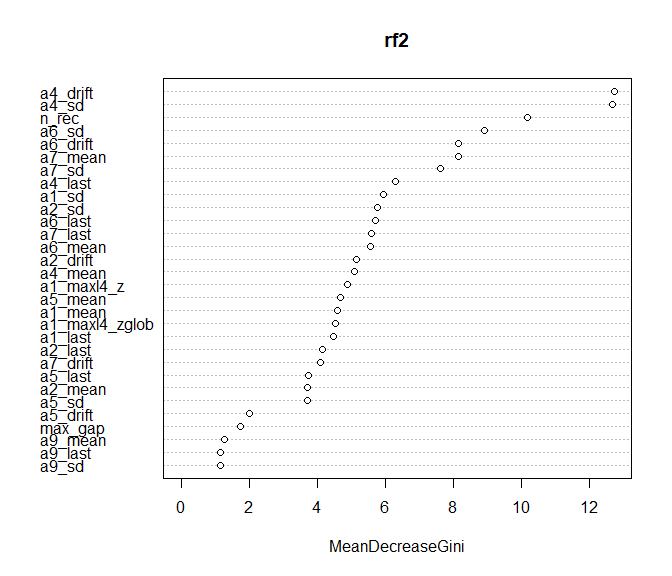<!-- -->

I've reached a good stopping point, but its worthwhile to compare a few other ML algorithms.  I used H2O to do that since it has a consistent interface and makes it easy to experiment.

## H2O

The default distributed random forest model perfomed similarly to the model above:


```r
rtrn <- build_fea(data)
rtrn$failure <- as.factor(rtrn$failure)
train <- as.h2o(rtrn, destination_frame = 'train')

y <- "failure"
x <- setdiff(names(rtrn), c(y, 'device', 'rdate', 'n5d_fails'))

drf2 <- h2o.randomForest(x = x,
                        y = y,
                        training_frame = train,
                        ntrees = 50,
                        nfolds = 10,
                        fold_assignment = "Modulo",
                        keep_cross_validation_predictions = TRUE,
                        seed = 9)

drf2_auc <- drf2@model$cross_validation_metrics@metrics$AUC
drf2_prob <- h2o.getFrame(drf2@model$cross_validation_holdout_predictions_frame_id$name)[,3] %>% as.data.table %>% .[[1]]
drf2_pred <- h2o.getFrame(drf2@model$cross_validation_holdout_predictions_frame_id$name)[,1] %>% as.data.table %>% .[[1]] 
truth <- train$failure %>% as.data.table %>% .[[1]]

#table(rf2_pred, truth)
sprintf('AUC for H2O distributed random forest: %5.3f', drf2_auc)
```

```
## [1] "AUC for H2O distributed random forest: 0.953"
```

I also experimented with Deep Learning models and GLM with both resulting in expectedly poor result. There's not enough data to train a DL model, and the ration of features to observations is also problematic for GLM. GLM might have performed better after some variable selection hints from random forest, but I didn't pursue that. H2O's gbm algorithm produced somewhat better results after hyper parameter tuning (performed using H2O Flow)


```r
gbm1 <- h2o.gbm(x = x,
                y = y,
                training_frame = train,
                ntrees = 45,
                max_depth = 11,
                min_rows = 5,
                learn_rate = 0.08,
                distribution = 'bernoulli',
                col_sample_rate = 0.4,
                min_split_improvement = 0.0001,
                balance_classes = FALSE,
                
                nfolds = 10,
                fold_assignment = "Modulo",
                keep_cross_validation_predictions = TRUE,
                seed = 9)

gbm1_auc <- gbm1@model$cross_validation_metrics@metrics$AUC
gbm1_prob <- h2o.getFrame(gbm1@model$cross_validation_holdout_predictions_frame_id$name)[,3] %>% as.data.table %>% .[[1]]
gbm1_pred <- h2o.getFrame(gbm1@model$cross_validation_holdout_predictions_frame_id$name)[,1] %>% as.data.table %>% .[[1]] 

sprintf('AUC for H2O gradient boosted machine: %5.3f', gbm1_auc)
```

```
## [1] "AUC for H2O gradient boosted machine: 0.961"
```

Side by side metrics comparison for all 3 models:


```r
plot_grid(nrow = 1, rel_widths = c(1,1,1.4),
          plot_metrics(trn$pred_prob, trn$failure, auc(rf2.roc)) + 
              guides(color=FALSE) +
              ggtitle(sprintf('RF AUC=%5.3f', auc(rf2.roc))),
          plot_metrics(trn$pred_prob, trn$failure, drf2_auc) + 
              guides(color=FALSE) +
              ggtitle(sprintf('H2O-RF AUC=%5.3f', drf2_auc)),
          plot_metrics(trn$pred_prob, trn$failure, gbm1_auc) +
              ggtitle(sprintf('H2O-GBM AUC=%5.3f', gbm1_auc))
)
```

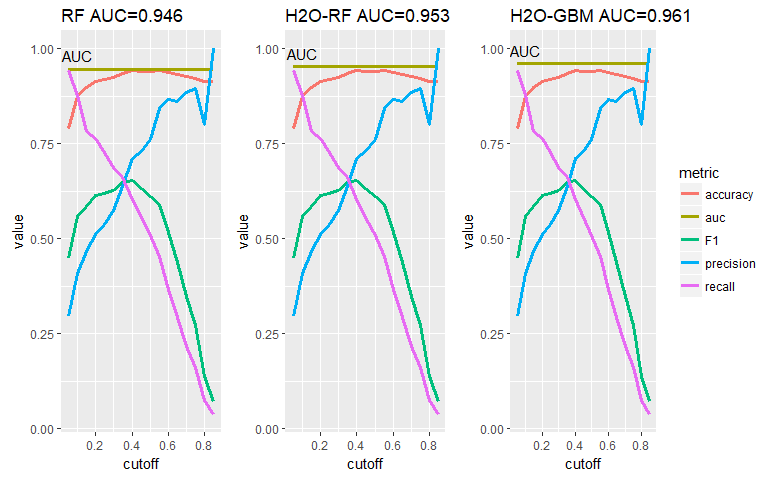<!-- -->

